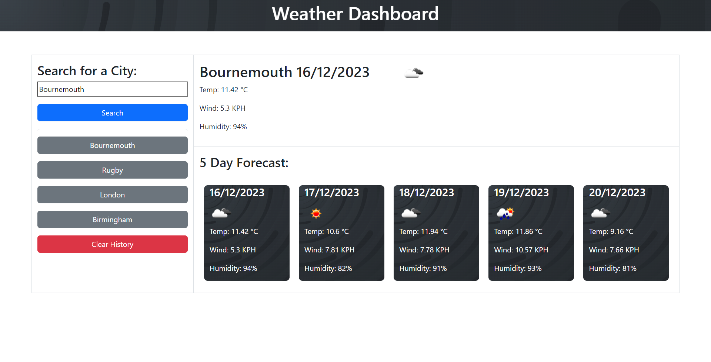

# Weather-Dashboard

## Description

My motivation for this project was to use HTML, CSS, JavaScript, Day.js and also a Weather API to create a weather dashboard that lets you type in a city and it will give you the current and also the 5 day forecast for that City. The dashboard will also keep previous entered cities in your history. This solves a problem of having to search around the web for the weather and also as it keeps the history of cities it also saves you the time of re-entering locations that you like to check the weather of often.

## Screenshot

## Installation

N/A

## Usage

This webpage can be used to find out the 5 day weather forecast in any city. To do this you click into the search bar and type in your City of choice, then if you click submit it will bring up that Cities 5 day weather forecast. Underneath the submit button it will also keep your previous searched Cities and this list can be cleared by pressing the clear button below.

## Link

https://mtlightfoot.github.io/weather-dashboard/

## Credits

N/A

## License

Please refer to the LICENSE in the repo.